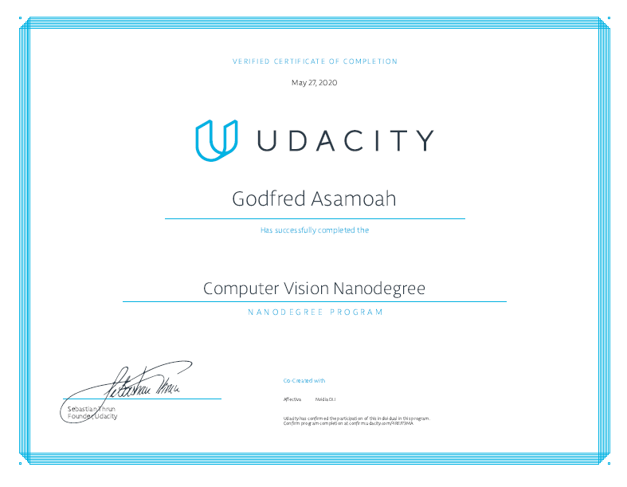

# Computer Vision Nanodegree Projects

This repository contains my projects for Udacity's [Computer Vision Nanodegree Program](https://www.udacity.com/course/computer-vision-nanodegree--nd891).

## Projects

- [1 - Facial Keypoint Detection](/1-facial-detection): Use image processing techniques and deep learning to recognize faces and facial keypoints, such as the location of the eyes and mouth on a face.

- [2 - Automatic Image Captioning](/2-image-captioning): Combine CNN and RNN knowledge to build a network that automatically produces captions, given an input image.

- [3 - Landmark Detection & Tracking](/3-landmark-detection): Use sensor data to localize a robot and build a map of the environment with SLAM.

## Graduation Certificate🎉🎉

[Certificate Link](https://confirm.udacity.com/4REJ73MA)
